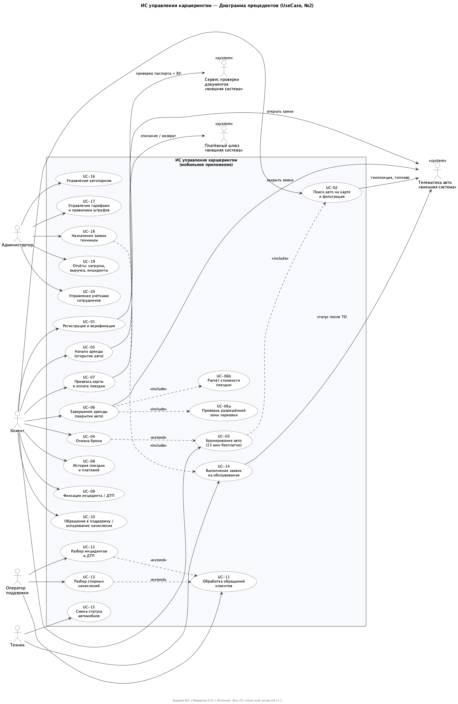

# Задание №2 — Диаграмма прецедентов (UseCase Diagram)

| | |
|---|---|
| **Проект** | Информационная система управления сервисом каршеринга |
| **Задание** | №2 UseCase Diagram. Составить диаграмму прецедентов |
| **Цель шага** | Основные действующие лица и их цели (без детализации бизнес-контекста и поведения системы) |
| **Ответственный** | Иващенко Е. О. (ПИ-б-о-241, технический лидер, архитектор) |
| **Помогали** | Бобренко А. И., Щербова А. А. |
| **Ревьюер** | Гуржуев В. А. |
| **Источник** | `docs/01-vision-and-scope.md` v1.1 |
| **Файлы** | `usecase.puml` — исходник (PlantUML), `usecase.png` — экспорт |

---

## 1. Граница системы

**ИС управления каршерингом (мобильное приложение).**

Внутри границы — только то, что реализует сама система: регистрация, поиск/бронь/аренда, оплата, инциденты, поддержка, управление парком, заявки, тарифы, отчёты.

Снаружи — люди-акторы и внешние системы. По решению из Vision отдельного веб-кабинета нет: сотрудники работают в том же мобильном приложении, интерфейс зависит от роли.

> Как пересобрать: `java -jar plantuml.jar -tpng usecase.puml` (нужны Java + Graphviz `dot`). Исходник — `usecase.puml`.

---

## 2. Акторы

Взяты 1-в-1 из раздела 2 Vision & Scope. Новых ролей не вводим (роли «Руководитель» нет — её покрывает Администратор).

| Актор | Тип | Цель (что хочет получить от системы) |
|---|---|---|
| **Клиент** | человек, основной | За минуты найти свободное авто рядом, забронировать, начать/завершить аренду, оплатить фактическое использование, получить помощь при проблеме |
| **Оператор поддержки** | человек, сотрудник | Обрабатывать обращения, разбирать инциденты/ДТП и спорные начисления, при необходимости связываться с клиентом во время аренды |
| **Техник** | человек, сотрудник | Видеть назначенные заявки, выполнять обслуживание (мойка, заправка, ТО), актуализировать статус авто |
| **Администратор** | человек, сотрудник | Управлять парком, тарифами и штрафами, назначать заявки, смотреть загрузку/выручку/инциденты, управлять учётками сотрудников |
| **Платёжный шлюз** `<<внешняя система>>` | система, вторичный | Списать / вернуть деньги. Карты не храним — всё через шлюз |
| **Телематика автомобиля** `<<внешняя система>>` | система, вторичный | Отдать геопозицию/топливо/статус, открыть/закрыть замки |
| **Сервис проверки документов** `<<внешняя система>>` | система, вторичный | Проверить паспорт + ВУ при регистрации/верификации |

---

## 3. Прецеденты (что умеет система)

Нумерация `UC-01…UC-20` — только для трассировки внутри проекта. На диаграмме в эллипсах — короткие названия, здесь — полные цели.

### 3.1 Клиент (10)

| ID | Прецедент | Цель клиента |
|---|---|---|
| UC-01 | Регистрация и верификация | Создать аккаунт, загрузить паспорт + ВУ, пройти проверку, получить доступ к аренде |
| UC-02 | Поиск авто на карте и фильтрация | Увидеть свободные авто рядом, отфильтровать по классу/топливу/расстоянию |
| UC-03 | Бронирование авто (15 мин бесплатно) | Зафиксировать авто за собой на 15 минут |
| UC-04 | Отмена брони | Освободить авто без начала аренды |
| UC-05 | Начало аренды (открытие авто) | Открыть авто через приложение и начать поездку |
| UC-06 | Завершение аренды (закрытие авто) | Закрыть авто, убедиться что парковка в разрешённой зоне, получить расчёт |
| UC-07 | Привязка карты и оплата поездки | Привязать карту, оплатить поездку (списание через шлюз) |
| UC-08 | История поездок и платежей | Посмотреть прошлые поездки, чеки, списания |
| UC-09 | Фиксация инцидента / ДТП | Зафиксировать инцидент/ДТП с фото и описанием прямо из аренды |
| UC-10 | Обращение в поддержку / оспаривание начисления | Написать в поддержку, оспорить штраф/доплату с приложением доказательств |

Вспомогательные (не вызываются актором напрямую, только через `<<include>>`):

| ID | Прецедент | Зачем |
|---|---|---|
| UC-06a | Проверка разрешённой зоны парковки | Часть UC-06: завершить аренду можно только внутри зоны Симферополя и не в запрещённом месте |
| UC-06b | Расчёт стоимости поездки | Часть UC-06: посчитать по тарифам (движение 8 ₽/мин, ожидание 4 ₽/мин, сутки 1500 ₽ — см. Vision, прил. А) |

### 3.2 Оператор поддержки (3)

| ID | Прецедент | Цель |
|---|---|---|
| UC-11 | Обработка обращений клиентов | Базовый прецедент: принять, классифицировать, ответить/закрыть обращение |
| UC-12 | Разбор инцидентов и ДТП | `<<extend>>` UC-11: частный случай — инцидент/ДТП, фиксация вины, расчёт доли клиента |
| UC-13 | Разбор спорных начислений | `<<extend>>` UC-11: частный случай — проверить основание и доказательства штрафа, подтвердить/отменить |

### 3.3 Техник (2)

| ID | Прецедент | Цель |
|---|---|---|
| UC-14 | Выполнение заявок на обслуживание | Взять назначенную заявку, выполнить (мойка/заправка/ТО), отчитаться |
| UC-15 | Смена статуса автомобиля | Перевести авто: свободен / в аренде / на обслуживании / недоступен |

### 3.4 Администратор (5)

| ID | Прецедент | Цель |
|---|---|---|
| UC-16 | Управление автопарком | Добавить/изменить авто, следить за статусами |
| UC-17 | Управление тарифами и правилами штрафов | Менять тарифы и правила (значения — из Vision, прил. А) |
| UC-18 | Назначение заявок техникам | Создать заявку на обслуживание/ремонт, назначить техника, контролировать выполнение (`<<include>>` UC-14) |
| UC-19 | Отчёты: загрузка, выручка, инциденты | Получить базовые отчёты для контроля |
| UC-20 | Управление учётками сотрудников | Создавать/блокировать учётки операторов, техников, админов |

---

## 4. Связи `include` / `extend` — почему так

| Связь | Тип | Обоснование |
|---|---|---|
| UC-03 `..>` UC-02 | `<<include>>` | Забронировать можно только то, что нашёл. Бронь всегда включает поиск/выбор авто |
| UC-04 `..>` UC-03 | `<<extend>>` | Отмена — необязательное расширение брони: возникает не всегда, только если клиент передумал |
| UC-06 `..>` UC-06a | `<<include>>` | Завершение обязательно включает проверку зоны (иначе система не должна закрывать аренду) |
| UC-06 `..>` UC-06b | `<<include>>` | Завершение обязательно включает расчёт стоимости |
| UC-12 `..>` UC-11 | `<<extend>>` | Разбор инцидента — специализация обработки обращения |
| UC-13 `..>` UC-11 | `<<extend>>` | Разбор спора — специализация обработки обращения |
| UC-18 `..>` UC-14 | `<<include>>` | Назначение заявки включает её выполнение техником как обязательную часть жизненного цикла заявки |

Других `include/extend` на этом уровне сознательно нет — детализация поведения будет в задании №3 (Activity) и №4 (бизнес-правила).

---

## 5. Связи с внешними системами

| Прецедент | Система | Что запрашиваем |
|---|---|---|
| UC-01 | Сервис проверки документов | Проверка паспорта + ВУ (возраст 21+, стаж 2+ — см. Vision) |
| UC-02 | Телематика | Геопозиция, топливо, статус для карты |
| UC-05 | Телематика | Открыть замки, подтвердить статус |
| UC-06 | Телематика | Закрыть замки, зафиксировать геопозицию |
| UC-07 | Платёжный шлюз | Списание / возврат |
| UC-14 | Телематика | Актуализировать статус после ТО |

На диаграмме внешние системы — акторы со стереотипом `<<system>>`, чтобы сразу было видно: это не люди и не часть нашей разработки (в учебном проекте заменяются заглушками).

---

## 6. Трассировка к Vision & Scope (In Scope → UC)

| In Scope из Vision | Покрывается |
|---|---|
| Регистрация и верификация | UC-01 |
| Карта и список свободных авто с фильтрацией | UC-02 |
| Бронирование на 15 мин, отмена | UC-03, UC-04 |
| Начало (открытие) / завершение (закрытие, проверка зоны) | UC-05, UC-06 (+UC-06a) |
| Тарифы поминутные/суточные, расчёт | UC-06b, UC-17 |
| Оплата, привязка карты, история платежей | UC-07, UC-08 |
| Штрафы и доплаты | UC-17 (правила), UC-10/UC-13 (оспаривание) |
| Инциденты и ДТП: фиксация клиентом, обработка оператором | UC-09, UC-12 |
| Обращения и разбор споров | UC-10, UC-11, UC-13 |
| Управление парком, статусы | UC-16, UC-15 |
| Заявки на обслуживание, назначение, контроль | UC-18, UC-14 |
| Базовые отчёты | UC-19 |

Out of Scope (сайт, ГИБДД-интеграция, страховые, лояльность, динамические цены, юрлица, межгород, распознавание повреждений по фото, железо телематики, бухгалтерия) — на диаграмме отсутствует сознательно.

---

## 7. Что НЕ входит в эту диаграмму (по цели шага)

- Нет описания шагов внутри прецедентов и бизнес-правил (тарифы/штрафы детально — задание №4, процессы — задание №3).
- Нет сущностей и их атрибутов (задание №4).
- Нет экранов, API, архитектуры и последовательности действий — это не UseCase-уровень.
- Нет альтернативных/исключительных потоков (нестабильный интернет, отказ шлюза) — будут в Activity при необходимости.

---

## 8. Принятые решения

1. Один прямоугольник границы — «ИС управления каршерингом (мобильное приложение)». Отдельных подсистем не выделяем — верхнеуровневый срез.
2. Все сотрудники — в том же приложении с ролевым интерфейсом (решение Vision). Поэтому Оператор/Техник/Админ — акторы к той же границе, а не к отдельным системам.
3. UC-06a/UC-06b вынесены как включаемые, чтобы показать обязательные проверки при завершении, но без погружения в логику.
4. UC-12/UC-13 — через `extend`, а не дублированием: подчёркиваем, что это специализации UC-11.
5. Формат диаграмм команды — PlantUML (исходник + PNG), по зоне ответственности Иващенко.

---

## 9. Файлы папки

- `usecase.puml` — исходник диаграммы
- `usecase.png` — экспорт для просмотра и вставки в отчёты
- `README.md` — этот документ (описание акторов, прецедентов, связей, трассировка)
