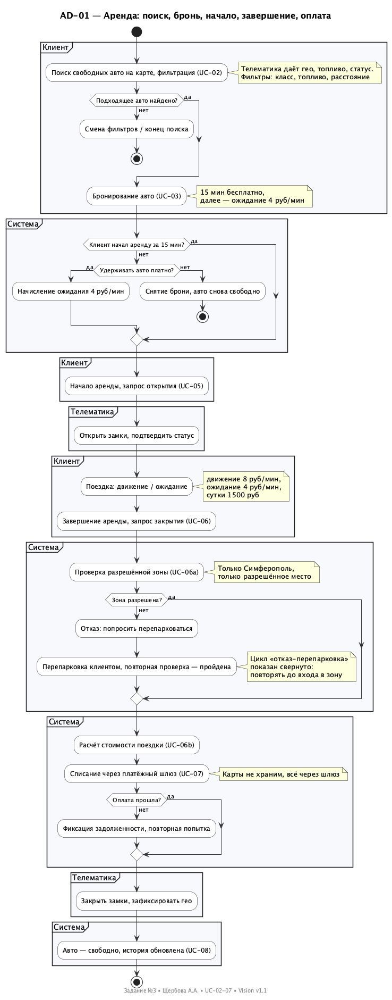
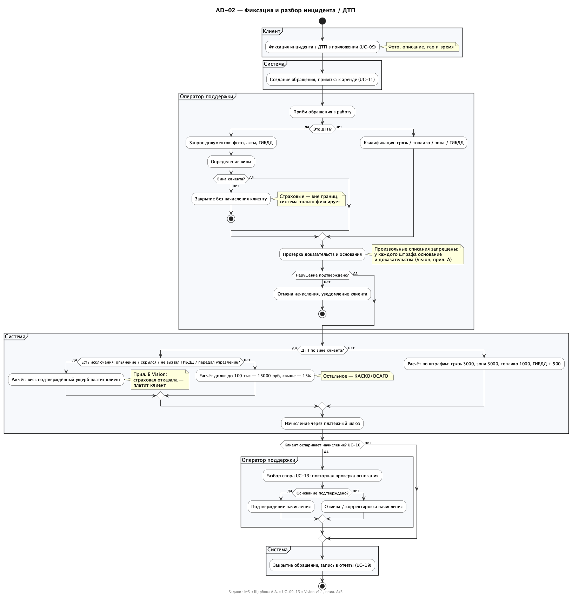
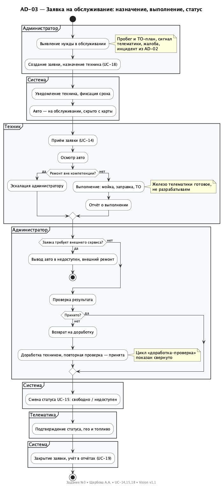

# Задание №3 — Диаграммы деятельности (Activity Diagrams)

| | |
|---|---|
| **Проект** | Информационная система управления сервисом каршеринга |
| **Задание** | №3 Activity Diagrams. Выбрать 2–3 сложных прецедента, смоделировать бизнес-процессы |
| **Цель шага** | Выявить правила и ограничения, описать процессы предметной области, в контексте которой будет внедряться система |
| **Ответственная** | Щербова А. А. (ПИ-б-о-242, аналитик бизнес-процессов) |
| **Помогали** | Диденко А. Е., Иващенко Е. О. |
| **Ревьюер** | Бобренко А. И. |
| **Источники** | `docs/01-vision-and-scope.md` v1.1, `docs/02-usecase-diagram/` (UC-01…UC-20) |
| **Файлы** | `ad01-rental.puml/.png`, `ad02-incident.puml/.png`, `ad03-maintenance.puml/.png` |

Дорожки (`partition`) = роли/системы. Жёлтые заметки — правила из Vision, которые процесс проверяет. Циклы «перепарковка» и «доработка» показаны свёрнуто, чтобы не раздувать схему.

---

## Почему выбраны эти 3 процесса

| Процесс | Покрывает UC | Почему сложный |
|---|---|---|
| AD-01 Аренда: поиск → бронь → начало → завершение → оплата | UC-02, UC-03, UC-04, UC-05, UC-06 (+06a, 06b), UC-07, UC-08 | Сквозной процесс через клиента, систему, телематику и шлюз. Ветки: бронь 15 мин, зона парковки, оплата/задолженность. Ядро ценности сервиса |
| AD-02 Инцидент / ДТП: фиксация → разбор → начисление → спор | UC-09, UC-11, UC-12, UC-10, UC-13 | Ветвления по вине, исключениям из прил. Б, доказательствам из прил. А. Связка клиент → оператор → система |
| AD-03 Заявка на обслуживание: назначение → выполнение → статус | UC-18, UC-14, UC-15, UC-16, UC-19 | Кросс-ролевой процесс админ → техник → система → телематика. Статусы авто, эскалации, приёмка |

Остальные UC (регистрация UC-01, история UC-08, тарифы UC-17, отчёты UC-19, учётки UC-20) — линейные, их детализация на этом уровне избыточна.

---

## AD-01 — Аренда автомобиля

**Сценарий с точки зрения пользователя:** нашёл авто рядом → забронировал → открыл → доехал → закрыл → оплатил.

**Ветвления и правила, которые выявил процесс:**

1. Бронь: 15 мин бесплатно, далее удержание — как ожидание 4 ₽/мин, иначе бронь снимается и авто снова свободно.
2. Начало без брони возможно (подошёл к свободному авто), но диаграмма показывает основной путь через бронь.
3. Завершение жёстко связано с зоной: только Симферополь и только разрешённое место (UC-06a). Отказ → перепарковка → повтор (цикл свёрнут).
4. Расчёт (UC-06b) по фиксированным тарифам: движение 8 ₽/мин, ожидание 4 ₽/мин, сутки 1500 ₽.
5. Оплата только через шлюз, карты не храним. Неуспех → задолженность и повтор, но замки и статус фиксируются только после расчёта.
6. После закрытия: авто → «свободно», история поездок (UC-08) обновляется.

> Как пересобрать: `java -jar plantuml.jar -tpng ad01-rental.puml`

---

## AD-02 — Инцидент / ДТП

**Сценарий:** клиент фиксирует (фото, гео, время) → система создаёт обращение → оператор разбирает → начисление → при споре повторная проверка.

**Ветвления и правила:**

1. ДТП и мелкий инцидент разводятся рано: ДТП требует документов/ГИБДД и определения вины, мелочь — сразу квалификации (грязь / топливо / зона / ГИБДД-штраф).
2. Если вины клиента нет — закрытие без начисления; страховые — вне границ, система только фиксирует (Vision §4).
3. Ключевое ограничение из прил. А: произвольные списания запрещены, у каждого штрафа основание + доказательства. Не подтверждено → отмена.
4. ДТП по вине: сначала проверка исключений прил. Б (опьянение, скрылся, не вызвал ГИБДД, передал управление). Есть исключение → весь подтверждённый ущерб на клиенте. Нет → франшиза: до 100 тыс. — 15 000 ₽, свыше — 15%, остальное КАСКО/ОСАГО.
5. Не-ДТП: грязный салон 3000, зона 3000, топливо 1000, ГИБДД-штраф + 500 за перевыставление.
6. Оспаривание (UC-10 → UC-13) — отдельная ветка после начисления, а не часть основного разбора. Подтверждено → оставить, нет → отменить/скорректировать.
7. Закрытие всегда пишет в отчёты (UC-19) — вход для задания №4 по сущностям «Инцидент», «Обращение», «Начисление».

---

## AD-03 — Заявка на обслуживание

**Сценарий:** админ выявляет нужду → создаёт заявку → техник выполняет → админ принимает → статус обновлён.

**Ветвления и правила:**

1. Источники заявки: ТО-план/пробег, сигнал телематики, жалоба, инцидент из AD-02.
2. На время работ авто — «на обслуживании», скрыто с карты клиентов (связь со статусами UC-15: свободен / в аренде / на обслуживании / недоступен).
3. Ремонт вне компетенции → эскалация и вывод в «недоступен» + внешний сервис (конец ветки).
4. Приёмка обязательна: не принято → доработка → повторная проверка (цикл свёрнут).
5. Закрытие синхронизирует три места: статус UC-15, телематику (гео/топливо) и отчёты UC-19.
6. Железо телематики — готовое, не разрабатываем (Out of Scope) — техник только подтверждает статус.

---

## Сводка правил и ограничений для задания №4

| № | Правило / ограничение | Источник | Куда в №4 |
|---|---|---|---|
| R-01 | Бронь 15 мин бесплатно, далее 4 ₽/мин; иначе снятие | Vision, прил. А; AD-01 | Бизнес-правило «Бронирование», сущность «Бронь» (срок, статус) |
| R-02 | Завершение только в зоне Симферополя и разрешённом месте | Vision §3–4; AD-01 | Правило «Зона», сущность «Аренда» (гео закрытия) |
| R-03 | Тарифы: 8 / 4 / 1500 ₽; расчёт при завершении | Прил. А; AD-01 | Правило «Тарификация», сущность «Поездка/Оплата» |
| R-04 | Карты не храним, оплата через шлюз; задолженность при неуспехе | Vision §5; AD-01 | Ограничение, сущность «Платёж» |
| R-05 | Статусы авто: свободен / в аренде / на обслуживании / недоступен | Vision §4; AD-01, AD-03 | Сущность «Автомобиль» |
| R-06 | У штрафа обязательны основание + доказательства; иначе отмена | Прил. А; AD-02 | Правило «Штрафы», сущности «Начисление», «Доказательство» |
| R-07 | ДТП по вине: ≤100 тыс. → 15 000, >100 тыс. → 15% | Прил. А; AD-02 | Правило «Франшиза» |
| R-08 | Исключения прил. Б → весь ущерб на клиенте | Прил. Б; AD-02 | Правило «Исключения», сущность «Инцидент» |
| R-09 | Страховые вне системы; система только фиксирует и считает долю | Vision §4; AD-02 | Граница, сущность «Инцидент» |
| R-10 | Оспаривание — отдельной веткой после начисления (UC-10 → UC-13) | AD-02 | Процесс «Спор», сущность «Обращение» |
| R-11 | Заявка: назначение → выполнение → приёмка → статус + отчёты | AD-03 | Сущности «Заявка», «ТО», связь с «Автомобиль» |

---

## Трассировка UC → AD

| UC | AD |
|---|---|
| UC-02, UC-03, UC-04, UC-05, UC-06, UC-06a, UC-06b, UC-07, UC-08 | AD-01 |
| UC-09, UC-10, UC-11, UC-12, UC-13 | AD-02 |
| UC-14, UC-15, UC-16, UC-18, UC-19 | AD-03 |
| UC-01, UC-17, UC-20 | Не детализируются (линейные, правила — в №4) |

---

## Допущения

1. Нестабильный интернет у клиента показан только через «повтор запроса»; ретраи и офлайн — вне уровня.
2. Отказы шлюза/телематики — как «задолженность» / «недоступен», без моделирования таймаутов.
3. Параллельность (клиент едет, оператор пишет) не моделируем — только порядок по процессу.
4. Экраны и API не описываем — это уровень требований, не процесса.

---

## Файлы папки

- `ad01-rental.puml` / `ad01-rental.png` — аренда
- `ad02-incident.puml` / `ad02-incident.png` — инцидент/ДТП
- `ad03-maintenance.puml` / `ad03-maintenance.png` — обслуживание
- `README.md` — этот документ
